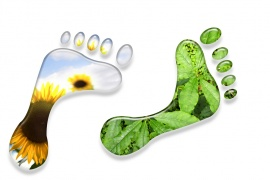
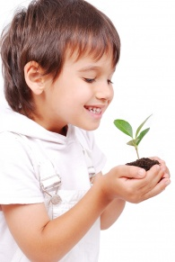

# Om FRØ

Foreningen for Ressursbasert Økonomi (FRØ) er en
nystartet, frivillig organisasjon. FRØ er en del av et
internasjonalt nettverk som arbeider for å fremme bærekraftige
løsninger som tar hensyn til både mennesker og miljøet.

Verden gjennomgår dyptgripende endringer. Teknologisk fremgang
har gitt menneskeheten muligheter vi aldri før har hatt, men den er
et tveegget sverd. Vi har mulighet til å skape overflod og
velstand, eller legge grunnlaget for vår egen undergang. Det er opp
til oss å få samfunnet opp til et nivå der vi bruker kunnskap og
teknologi til gode formål og for å oppnå en dynamisk balanse med
planeten og dens økosystemer.

Dette er ingen liten utfordring. Likevel jobber tusenvis av
grupper, frivillige organisasjoner, bedrifter og enkeltpersoner for
positiv forandring i verden. FRØ er en kunnskapsbasert organisasjon
som formidler informasjon om slike grupper, samt bærekraftige
løsninger knyttet til teknologi og forskning.

FRØs langsiktige mål er å oppnå en fredelig overgang til en ny
samfunnsstruktur basert på ressursbasert økonomi. I en
ressursbasert økonomi er det tilgangen til ressurser, og ikke
penger, som ligger til grunn for hvilke valg vi gjør. Den
vitenskapelige metode anvendes for å skape et så optimalt samfunn
som mulig, basert på våre behov og hva tilgjengelig forskning
viser. For å sikre bærekraft bør fremtidsplanlegging og
avgjørelser, etter FRØs mening, baseres på vitenskapelige
prinsipper for å minimere subjektivitet. Samtidig er det avgjørende
at vi benytter helhetlig systemtenkning for å kunne skape et
samfunn som fungerer på alle plan.

Ordet «økonomi» kommer fra gresk og betyr
«husholdning». I en velfungerende husholdning tar man vare på
ressurser, forvalter dem best mulig og skaper minimalt med avfall.
Er det dette vi ser i dagens bruk-og-kast-samfunn? Kan måten vi
lever på i et hushold på sikt videreføres til lokalsamfunnet og
tilslutt til et globalt hushold? I dag har vi nok materielle
ressurser til å gi en svært høy levestandard til alle innbyggere på
jorda. I en ressursbasert økonomi vil varer og tjenester være
tilgjengelige uten bruk av penger, kreditt, byttehandel eller
lignende.

I en ressursbasert økonomi betraktes jordas ressurser som
menneskehetens felles arv i stedet for at de eies av et fåtall
personer. En viktig del av en ressursbasert økonomi er å bevege seg
vekk fra et konkurransebasert samfunn til en samfunnsstruktur som
bygger på samarbeid. Dette vil over tid gjøre at vi utvikler oss
forbi kunstige grenser som separerer mennesker. Et eksempel som kan
gjøre det lettere å forstå hvordan dette kan være mulig er å tenke
på open source og crowd intelligence, altså en struktur som bygges
opp fra bunnen av gjennom frivillig samarbeid og slett ikke gjennom
tvang. Det er mange eksempler på at vi allerede beveger oss i denne
retningen og det er viktig å påpeke at ressursbasert økonomi ikke
er et ovenfra-og-ned system, men nettopp det motsatte.

